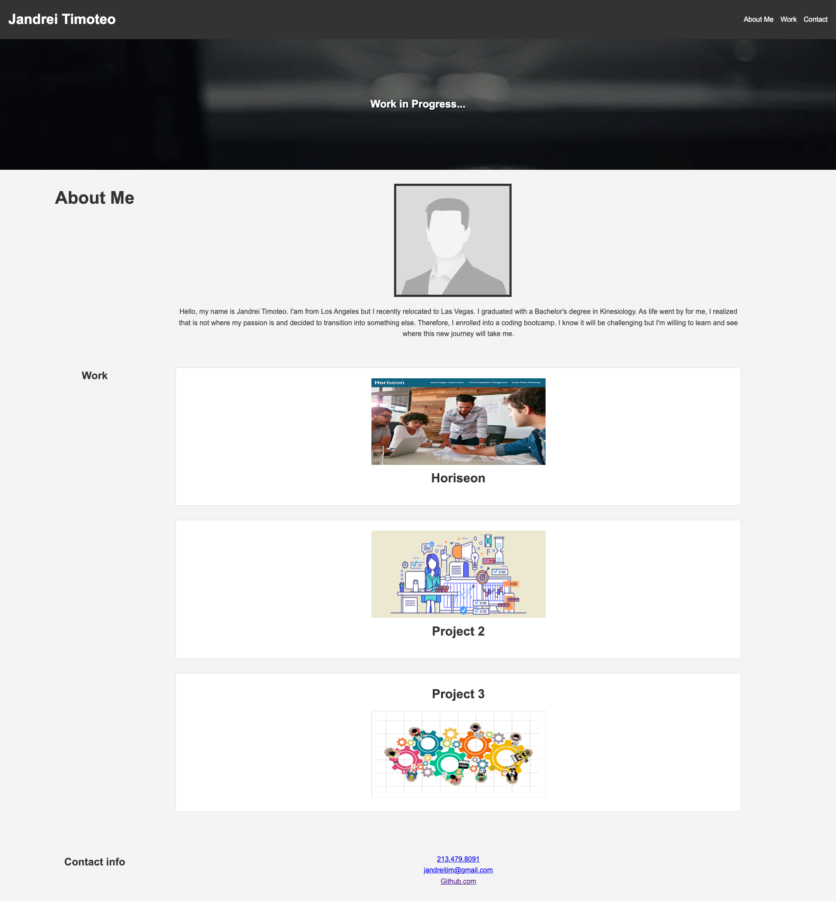

# Portfolio

## Purpose
A portfolio serves as a curated showcase of an individual's or a professional's achievements, capabilities, and creative endeavors. A portfolio's purpose is to have an understanding of an individual's accomplishments and skills to a diverse audience, such as potential employers.

##  Website

## Credits
Sheetal-srikumar (Tutor) https://calendly.com/fsf-tutor-team/sheetal-srikumar
- Helped with styling CSS and formatting HTML